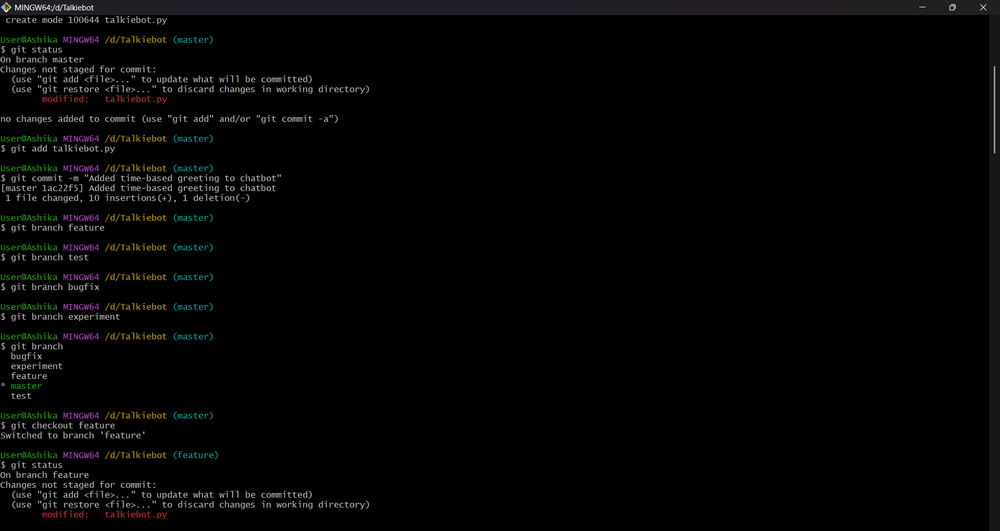
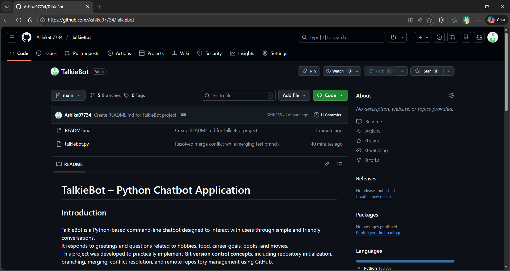
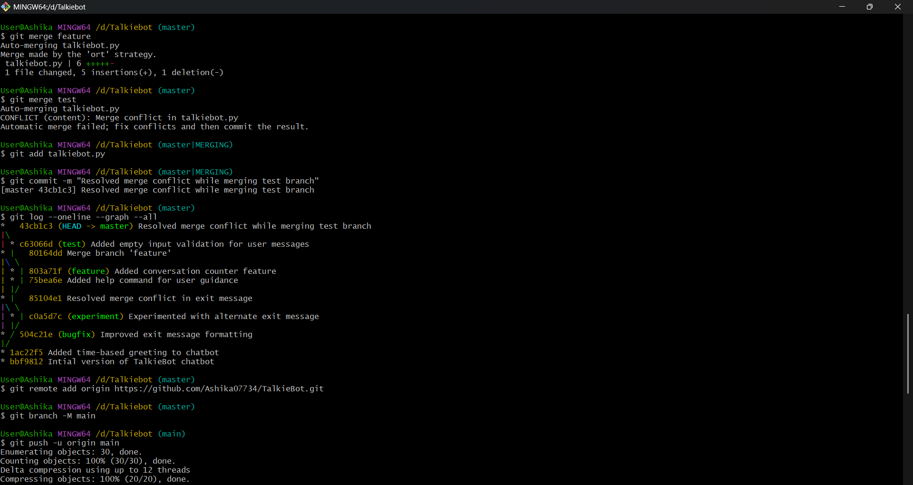
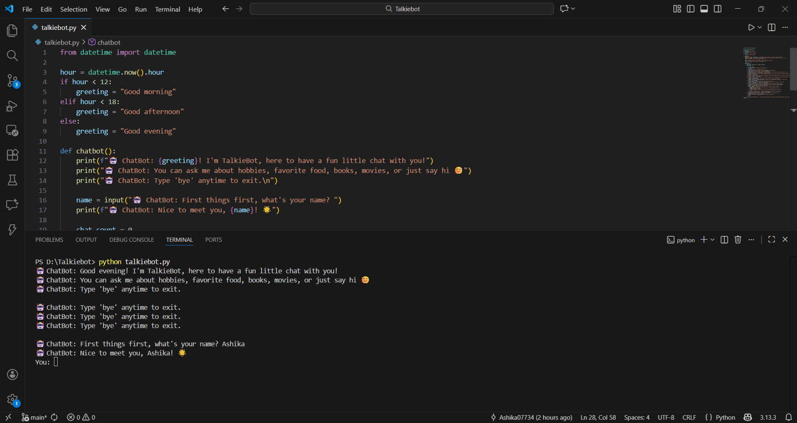

# TalkieBot – Python Chatbot Application

## Introduction
TalkieBot is a Python-based command-line chatbot designed to interact with users through simple and friendly conversations.  
It responds to greetings and questions related to hobbies, food, career goals, books, and movies.  
This project was developed to practically implement **Git version control concepts**, including repository initialization, branching, merging, conflict resolution, and remote repository management using GitHub.

---

## Commands Used
The following Git commands were used during the development and management of this project:

- `git init` – Initialize a local Git repository  
- `git status` – Check the current state of the repository  
- `git add` – Stage files for commit  
- `git commit` – Save changes with appropriate messages  
- `git branch` – Create and view branches  
- `git checkout` – Switch between different branches  
- `git merge` – Merge branches into the main branch  
- `git log` – View commit history  
- `git remote add origin` – Connect local repository to GitHub  
- `git push` – Push commits to the remote repository  

---

## Screenshots
**Git Screenshots**:

**Repo Screenshot**

**MergeConflict Screenshot**

**git-log**

**repo**

Screenshots included in the `screenshots` folder demonstrate the following:

- Git commit history showing multiple commits and merges  
- Creation and usage of multiple branches  
- Merge conflict occurrence and its resolution  
- Successful execution of the TalkieBot program 
- GitHub repository with uploaded project files  

---

## Challenges Faced
Several challenges were encountered during the project, such as understanding branch-specific file changes and resolving merge conflicts manually.  
Handling conflicts using Git conflict markers and managing multiple branches required careful attention.  
These challenges helped in developing a deeper understanding of Git workflows and version control practices.

---

## Directory Structure
```text
# TALKIEBOT – Directory Structure

TALKIEBOT/
│
├── screenshots/
│   ├── branches.png
│   ├── git-log.png
│   ├── MergeConflict.png
│   ├── output.png
│   └── repo.png
│
├── README.md
└── talkiebot.py
```


## Conclusion
This project successfully demonstrates the practical use of Git and GitHub for version control.  
By implementing branching, merging, and conflict resolution, the project provides hands-on experience with real-world software development practices.  
The TalkieBot application fulfills all the requirements of the Git practical assignment and follows proper documentation standards.

---

## Author
Ashika
